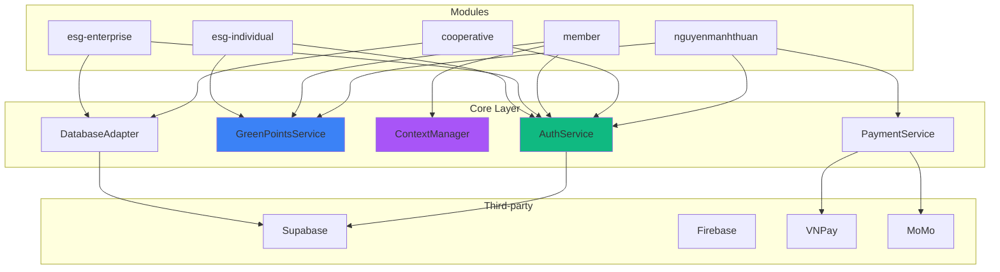

# DEPENDENCIES ANALYSIS BETWEEN MODULES

> **Ngày phân tích:** 26/01/2026  
> **Mục đích:** Phân tích dependencies giữa các modules và xác định shared dependencies

---

## 📊 DEPENDENCY GRAPH



---

## 🔗 SHARED DEPENDENCIES LIST

### 1. AuthService
**Location:** `src/core/application/auth/AuthService.ts`

**Used By:**
- ✅ `nguyenmanhthuan` module (Phase 02-03)
- ✅ `cooperative` module (Phase 04-06)
- ✅ `member` module (Phase 07-09)
- ✅ `esg-enterprise` module (Phase 10-11)
- ✅ `esg-individual` module (Phase 12)

**Dependencies:**
- `IAuthPort` (interface)
- `SupabaseAuthAdapter` (implementation)

**Status:** ✅ Planned in Phase 01

---

### 2. GreenPointsService
**Location:** `src/core/application/shared/GreenPointsService.ts` (to be created)

**Used By:**
- ✅ `nguyenmanhthuan` module (Phase 03)
- ✅ `member` module (Phase 07-09)
- ✅ `esg-individual` module (Phase 12)

**Current Usage:**
```typescript
// ❌ Current: Direct service call
import { earnPoints } from '../../lib/greenPoints/service';

// ✅ Target: Through service
import { GreenPointsService } from '@core/application/shared/GreenPointsService';
```

**Files to Migrate:**
- `src/pages/investor-wallet/page.tsx`
- `src/pages/consumer-wallet/page.tsx`
- `src/pages/farmer-consumer/page.tsx`
- `src/pages/investor-community/page.tsx`
- `src/pages/consumer-community/page.tsx`
- `src/pages/farmer-dashboard/page.tsx`
- `src/pages/member-hub/page.tsx`
- `src/pages/vita-green-dashboard/page.tsx`

**Status:** ⚠️ Needs to be created in Phase 01

---

### 3. ContextManager
**Location:** `src/core/application/context/ContextManager.ts` (to be created)

**Used By:**
- ✅ `member` module (Phase 07-09)

**Purpose:**
- Manage user context (active role, permissions)
- Handle context switching
- Resolve permissions based on context

**Status:** ⚠️ Needs to be created in Phase 07

---

### 4. PaymentService
**Location:** `src/core/application/shared/PaymentService.ts` (to be created)

**Used By:**
- ✅ `nguyenmanhthuan` module (Phase 03)
- ✅ `member` module (Phase 08-09)

**Dependencies:**
- `IPaymentPort` (interface)
- `VNPayAdapter` (implementation)
- `MoMoAdapter` (implementation)

**Status:** ⚠️ Needs to be created when payment is needed

---

### 5. DatabaseAdapter
**Location:** `src/core/infrastructure/adapters/database/DatabaseAdapter.ts` (to be created)

**Used By:**
- ✅ `cooperative` module (Phase 04-06)
- ✅ `esg-enterprise` module (Phase 10-11)

**Dependencies:**
- `IDatabasePort` (interface)
- `SupabaseDatabaseAdapter` (implementation)

**Status:** ⚠️ Needs to be created in Phase 01 or Phase 04

---

## 📋 MODULE DEPENDENCIES MATRIX

| Module | Depends On | Shared Services Used | Status |
|--------|-----------|---------------------|--------|
| **nguyenmanhthuan** | Core | AuthService, GreenPointsService, PaymentService | Phase 02-03 |
| **cooperative** | Core | AuthService, DatabaseAdapter | Phase 04-06 |
| **member** | Core | AuthService, ContextManager, GreenPointsService | Phase 07-09 |
| **esg-enterprise** | Core | AuthService, DatabaseAdapter | Phase 10-11 |
| **esg-individual** | Core, esg-enterprise | AuthService, GreenPointsService | Phase 12 |

---

## 🔄 CROSS-MODULE DEPENDENCIES

### 1. esg-individual → esg-enterprise
**Type:** Data aggregation

**Purpose:**
- Aggregate ESG data from enterprise projects
- Show individual's contribution to ESG projects

**Implementation:**
```typescript
// esg-individual module
import { ESGProjectService } from '@modules/esg-enterprise/application/ESGProjectService';

// Get projects where individual contributed
const projects = await esgProjectService.getProjectsByIndividual(userId);
```

**Status:** ⚠️ Needs careful design to avoid tight coupling

**Recommendation:**
- Use events/messaging instead of direct imports
- Or create shared domain models in `@core/domain/esg/`

---

### 2. member → All modules (indirect)
**Type:** Navigation/routing

**Purpose:**
- Member hub provides navigation to other modules
- Role switcher changes context across modules

**Implementation:**
- Use router navigation (no direct imports)
- Context changes affect all modules

**Status:** ✅ No tight coupling (uses routing)

---

## 🚫 CIRCULAR DEPENDENCY DETECTION

### Potential Circular Dependencies

#### 1. GreenPoints ↔ VitaScore
**Risk:** Medium

**Current:**
- `src/lib/greenPoints/service.ts`
- `src/lib/vitaScore/linkService.ts`

**Potential Issue:**
```typescript
// greenPoints/service.ts might import vitaScore
import { convertToVitaScore } from '../vitaScore/linkService';

// vitaScore/linkService.ts might import greenPoints
import { getUserGreenPoints } from '../greenPoints/service';
```

**Solution:**
- Move both to `@core/application/shared/`
- Ensure one-way dependency: `VitaScoreService` depends on `GreenPointsService`, not vice versa

---

#### 2. ContextManager ↔ AuthService
**Risk:** Low

**Potential Issue:**
- `ContextManager` might need `AuthService` to get current user
- `AuthService` might need `ContextManager` to check permissions

**Solution:**
- `ContextManager` depends on `AuthService` (one-way)
- `AuthService` should NOT depend on `ContextManager`
- Use events/callbacks if needed

---

## 📦 DEPENDENCY INJECTION STRATEGY

### Current Pattern (Target)
```typescript
// ✅ GOOD: Dependency Injection
export class AuthService {
  constructor(private authPort: IAuthPort) {}
}

// Usage
const authService = new AuthService(new SupabaseAuthAdapter());
```

### Module Service Pattern
```typescript
// Module-specific service
export class CooperativeService {
  constructor(
    private dbAdapter: DatabaseAdapter,
    private authService: AuthService
  ) {}
}
```

---

## 🎯 DEPENDENCY RESOLUTION PLAN

### Phase 01: Core Foundation
**Create:**
- ✅ `AuthService` + `IAuthPort` + `SupabaseAuthAdapter`
- ⚠️ `GreenPointsService` (should be created here)
- ⚠️ `DatabaseAdapter` + `IDatabasePort` (should be created here)

### Phase 03: Payment Integration
**Create:**
- `PaymentService` + `IPaymentPort` + `VNPayAdapter` + `MoMoAdapter`

### Phase 07: Context Management
**Create:**
- `ContextManager` + `IContextPort`

---

## 📊 DEPENDENCY METRICS

### Coupling Score (Lower is better)
- **Current:** High (direct imports everywhere)
- **Target:** Low (through interfaces/ports)

### Cohesion Score (Higher is better)
- **Current:** Low (mixed concerns)
- **Target:** High (clear module boundaries)

### Dependency Depth
- **Current:** 1-2 levels (page → service → library)
- **Target:** 3-4 levels (page → module service → core service → adapter → library)

---

## ✅ VERIFICATION CHECKLIST

- [ ] No circular dependencies
- [ ] All shared services in `@core`
- [ ] Module-specific services in `@modules/{module}`
- [ ] All dependencies injected (not imported directly)
- [ ] Interfaces defined for all external dependencies
- [ ] Adapters implemented for all third-party services
