# VITA COOP - Sơ đồ Workflow Hệ thống

Tài liệu này mô tả toàn bộ workflow và kiến trúc của hệ thống VITA COOP bằng hình ảnh trực quan.

## 📋 Mục lục

1. [Tổng quan Hệ thống](#1-tổng-quan-hệ-thống)
2. [Các Portal & Người dùng](#2-các-portal--người-dùng)
3. [Workflow Chính](#3-workflow-chính)
   - 3.1. Khởi tạo & Số hóa
   - 3.2. Kích hoạt Thị trường & Khớp lệnh
   - 3.3. Triển khai Sản xuất & Giám sát
   - 3.4. Thu hoạch, Thương mại & Tái đầu tư ⭐ MỚI
4. [Luồng Đăng nhập & Đăng ký](#4-luồng-đăng-nhập--đăng-ký)
5. [Luồng Sản xuất & Quản lý](#5-luồng-sản-xuất--quản-lý)

---

## 1. Tổng quan Hệ thống

```mermaid
graph TB
    subgraph "Entry Points"
        Landing[Landing Page /]
        Home[Home Page /home]
        Login[Login Page /login]
    end
    
    subgraph "VITA FARMER - Nông dân"
        FarmerDash[Farmer Dashboard]
        FarmerDiary[Nhật ký Điện tử]
        FarmerWallet[Ví Nông dân]
        FarmerFarm[Quản lý Nông trại]
        FarmerForestry[Lâm nghiệp]
    end
    
    subgraph "VITA ADMIN - HTX"
        AdminDash[Admin Dashboard]
        AdminGIS[GIS & Bản đồ]
        AdminWarehouse[Kho vận]
        AdminFinance[Tài chính]
        AdminMembers[Xã viên]
        AdminProduction[Sản xuất]
        AdminForestry[Lâm nghiệp]
    end
    
    subgraph "VITA RESEARCH - Nghiên cứu"
        ResearchLab[Research Lab]
        GeneNursery[Gene Nursery Hub]
        SeedMarketplace[Seed Marketplace]
        ExpertPortal[Expert Portal]
    end
    
    subgraph "VITA PARTNER - Đối tác B2B"
        PartnerDash[Partner Dashboard]
        PartnerOrder[Đặt hàng]
        PartnerTrace[Traceability]
    end
    
    subgraph "VITA ENTERPRISE - Doanh nghiệp"
        EnterpriseProc[Procurement]
        EnterpriseMatch[Matching]
        EnterpriseNegot[Negotiation]
    end
    
    subgraph "VITA INVESTMENT - Đầu tư"
        InvestorPortal[Investor Portal]
        ESGPortal[ESG Portal]
        TimberTrading[Timber Trading]
    end
    
    subgraph "VITA GOVERNMENT - Chính phủ"
        GovPortal[Gov Portal]
        GovOnboarding[Onboarding]
    end
    
    subgraph "GREENLIGHT - Điều hành"
        Greenlight[GreenLight Command]
    end
    
    Landing --> Home
    Home --> Login
    Login --> FarmerDash
    Login --> AdminDash
    Login --> ResearchLab
    Login --> PartnerDash
    Login --> EnterpriseProc
    
    FarmerDash --> FarmerDiary
    FarmerDash --> FarmerWallet
    FarmerDash --> FarmerFarm
    FarmerDash --> FarmerForestry
    
    AdminDash --> AdminGIS
    AdminDash --> AdminWarehouse
    AdminDash --> AdminFinance
    AdminDash --> AdminMembers
    AdminDash --> AdminProduction
    
    style Landing fill:#10b981
    style Home fill:#10b981
    style Greenlight fill:#1f2937
    style FarmerDash fill:#22c55e
    style AdminDash fill:#3b82f6
    style ResearchLab fill:#a855f7
    style PartnerDash fill:#6366f1
    style InvestorPortal fill:#f59e0b
```

---

## 2. Các Portal & Người dùng

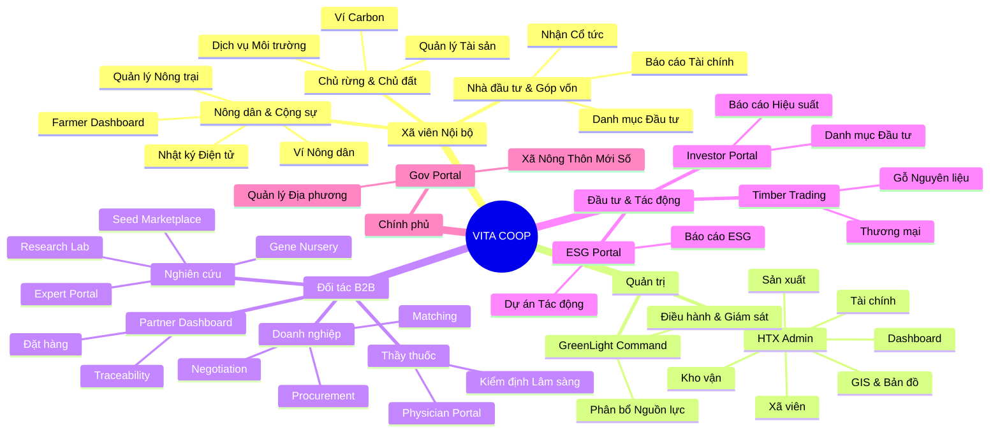

---

## 3. Workflow Chính

### 3.1. Workflow Khởi tạo & Số hóa (Phần 1)

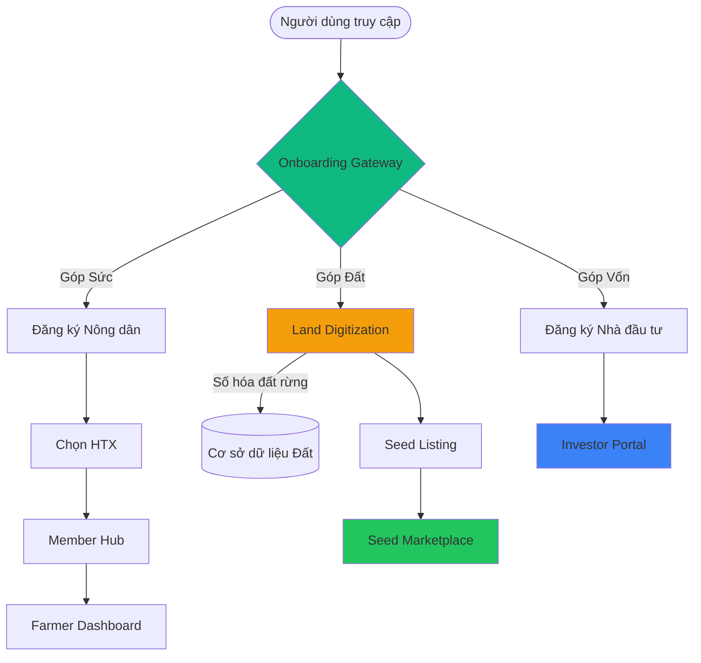

### 3.2. Workflow Kích hoạt Thị trường & Khớp lệnh (Phần 2)

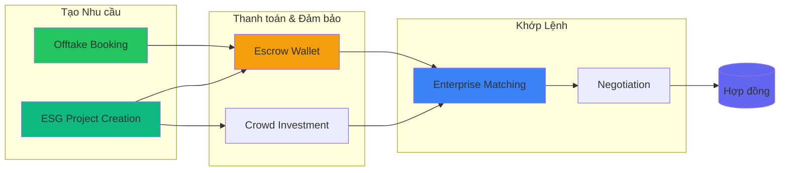

### 3.3. Workflow Triển khai Sản xuất & Giám sát (Phần 3)

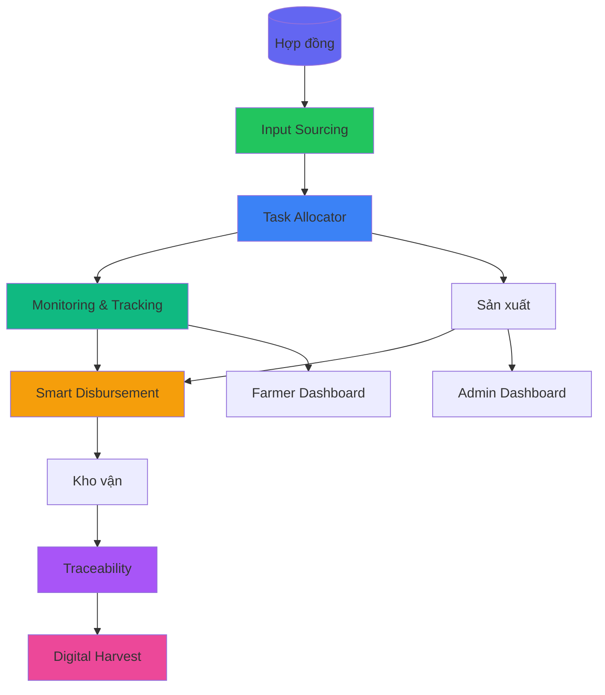

### 3.4. Workflow Thu hoạch, Thương mại & Tái đầu tư (Phần 4)

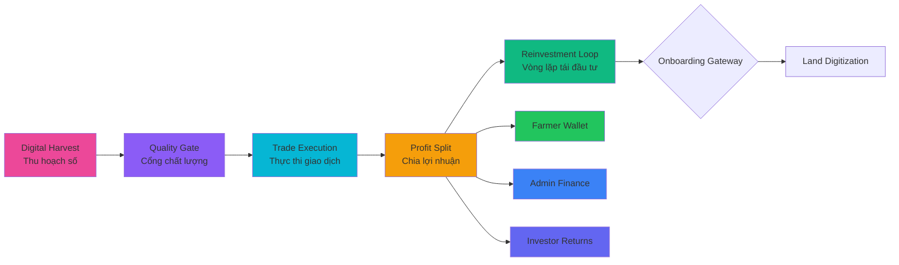

---

## 4. Luồng Đăng nhập & Đăng ký

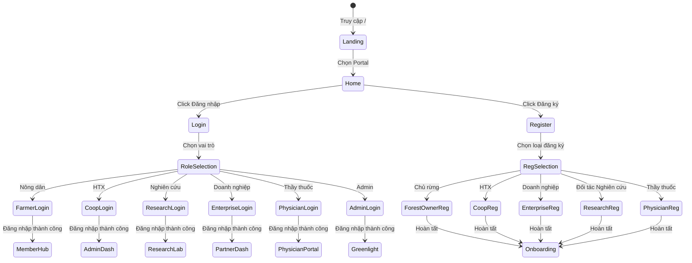

---

## 5. Luồng Sản xuất & Quản lý

### 5.1. Luồng Nông dân (Farmer Flow)

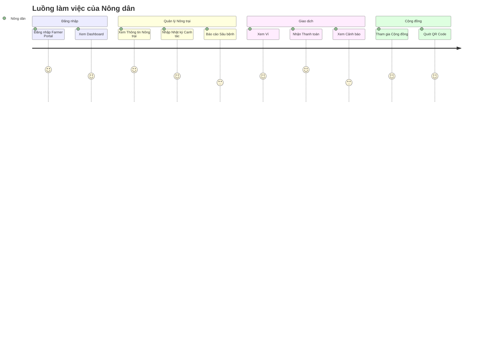

### 5.2. Luồng HTX Admin (Admin Flow)

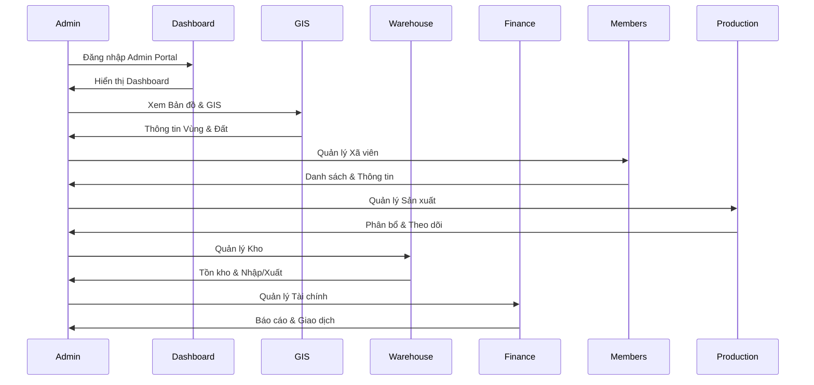

### 5.3. Luồng Đối tác Doanh nghiệp (Enterprise Flow)

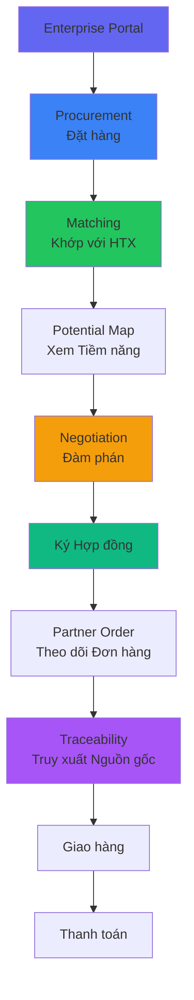

---

## 6. Kiến trúc Hệ thống

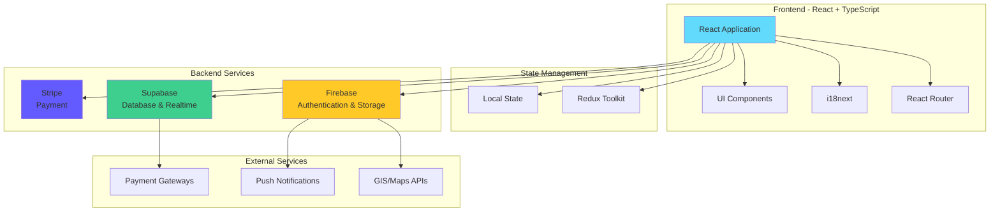

---

## 7. Cấu trúc Thư mục Chính

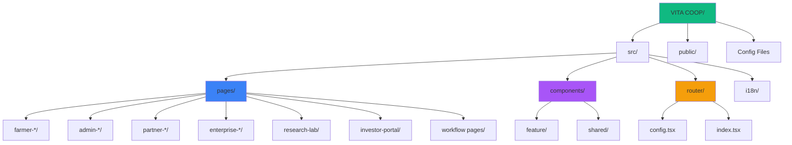

---

## 8. Các Route Chính

```mermaid
graph LR
    subgraph "Public Routes"
        R1[/ - Landing]
        R2[/home - Home]
        R3[/login - Login]
    end
    
    subgraph "Farmer Routes"
        F1[/farmer - Dashboard]
        F2[/farmer/diary - Nhật ký]
        F3[/farmer/wallet - Ví]
        F4[/farmer/farm - Nông trại]
    end
    
    subgraph "Admin Routes"
        A1[/admin - Dashboard]
        A2[/admin-gis - GIS]
        A3[/admin-warehouse - Kho]
        A4[/admin-finance - Tài chính]
    end
    
    subgraph "Workflow Routes"
        W1[/onboarding-gateway]
        W2[/land-digitization]
        W3[/offtake-booking]
        W4[/input-sourcing]
        W5[/digital-harvest]
        W6[/quality-gate]
        W7[/trade-execution]
        W8[/profit-split]
        W9[/reinvestment-loop]
    end
    
    R3 --> F1
    R3 --> A1
    R1 --> W1
```

---

## 📝 Ghi chú

### Cách xem sơ đồ:

1. **VS Code**: Cài extension "Markdown Preview Mermaid Support" hoặc "Mermaid Preview"
2. **GitHub**: Tự động render Mermaid khi push lên GitHub
3. **Online**: Copy code Mermaid và paste vào https://mermaid.live/
4. **Export ảnh**: Dùng https://mermaid.live/ để export PNG/SVG

### Các công cụ khác để tạo workflow:

- **Draw.io / diagrams.net**: Tool vẽ diagram trực quan
- **Lucidchart**: Tool chuyên nghiệp (có phí)
- **Figma**: Design tool, có thể vẽ flowcharts
- **Whimsical**: Tool đơn giản cho flowcharts và mindmaps

---

**Tác giả**: Hệ thống VITA COOP  
**Cập nhật**: 2024  
**Version**: 1.0

